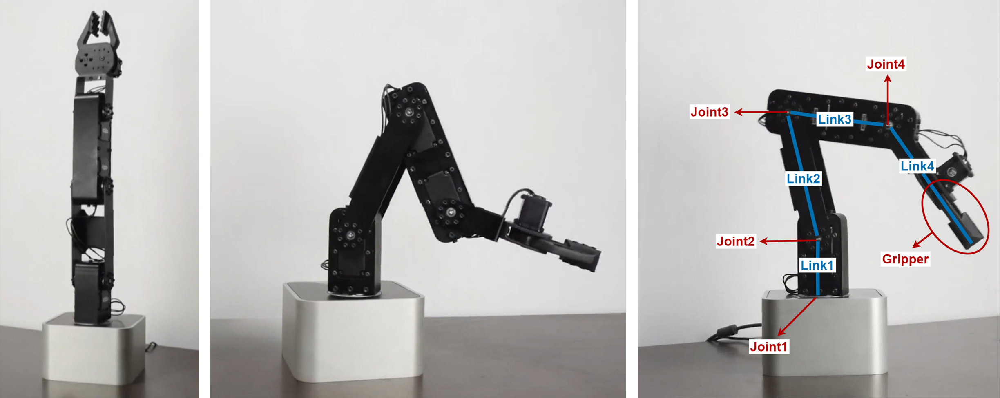

# QuadraArm: A 4-DOF Robotic Arm Platform from Hardware Design to Motion Planning

  
  
<em>The robotic arm in various configurations, with joints and links labeled</em>

   

**QuadraArm** is an open-source, Python-based framework for a custom-built 4-DOF (Degrees of Freedom) robotic arm. Developed as an educational and research-oriented project, QuadraArm integrates both hardware and software components to provide a reproducible end-to-end pipeline — covering everything from the mechanical structure and electronics to high-level motion control and planning algorithms."

The framework includes:
- A detailed overview of the robotic arm’s **mechanical structure**
- A documented **electrical schematic**
- Instructions on how to **set up the controller and configure the robot**
- Implementation of **forward and inverse kinematics**
- **Velocity kinematics**, covering both forward and inverse methods
- **Trajectory planning** via linear interpolation with configurable step size
- **Motion imitation via demonstration**, allowing replication of recorded reference trajectories

**Note:** Although CAD files are not provided, the arm’s mechanical and electrical structure is described in sufficient detail to enable reconstruction using off-the-shelf components and simple wiring.

📘 **Full documentation** → [📄 Will be available soon](#)

🤝 **Have a question, issue to report, or code to contribute?** → [📌 Contribution Guidelines](CONTRIBUTING.md)